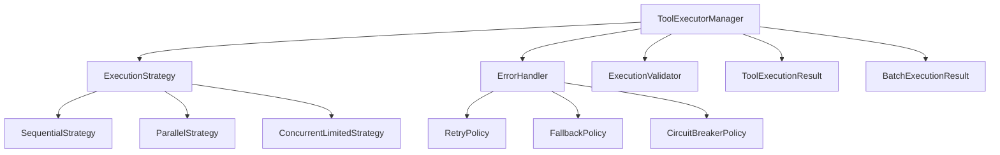

# Tool Execution Framework

A comprehensive, production-ready tool execution framework for multi-agent systems, designed with SOLID principles and clean architecture.

## Overview

The Tool Execution Framework provides a robust, flexible, and extensible system for executing tools with various execution strategies, error handling policies, and monitoring capabilities.

## Key Features

### 🏗️ **SOLID Design**
- **Single Responsibility**: Each class has one clear purpose
- **Open/Closed**: Easy to extend with new strategies and policies
- **Liskov Substitution**: All strategies and policies are interchangeable
- **Interface Segregation**: Small, focused interfaces
- **Dependency Inversion**: Depends on abstractions (protocols)

### 🚀 **Execution Strategies**
- **Sequential**: Execute tools one after another
- **Parallel**: Execute all tools simultaneously
- **Concurrent Limited**: Execute with controlled concurrency
- **Batched**: Execute in batches of specified size
- **Priority**: Execute based on priority order

### 🛡️ **Error Handling Policies**
- **Retry Policy**: Exponential backoff retry with jitter
- **Fallback Policy**: Alternative tools on failure
- **Circuit Breaker**: Fault tolerance with state management
- **Rate Limiting**: Handle rate limit errors gracefully
- **Composite**: Chain multiple error handlers
- **Conditional**: Route to different handlers by error type

### 📊 **Monitoring & Observability**
- Comprehensive execution metrics
- Circuit breaker status monitoring
- Execution timing and success rates
- Health checks and diagnostics
- Pre/post execution hooks

### ⚡ **Performance & Reliability**
- Async/sync execution support via AsyncBridge
- Thread-safe operation
- Timeout support
- Resource management
- Memory efficient

## Quick Start

### Basic Usage

```python
from elements.tools.common.execution import ToolExecutorManager, ExecutionMode

# Create executor
executor = ToolExecutorManager()

# Execute single tool
result = executor.execute(tool, {"arg": "value"})
print(f"Result: {result.result}, Success: {result.success}")

# Execute batch
batch_result = executor.execute_batch(
    tools=[(tool1, args1), (tool2, args2)],
    mode=ExecutionMode.PARALLEL
)
print(f"Batch: {batch_result.success_count}/{len(batch_result.results)} succeeded")
```

### With Error Handling

```python
from elements.tools.common.execution import ToolExecutorManager, RetryPolicy

# Create executor with retry policy
executor = ToolExecutorManager(
    error_handler=RetryPolicy(max_retries=3, initial_delay=1.0)
)

result = executor.execute(unreliable_tool, args)
```

### Advanced Configuration

```python
from elements.tools.common.execution import (
    ToolExecutorManager,
    CompositeErrorHandler,
    RetryPolicy,
    CircuitBreakerPolicy,
    ExecutionMode
)

# Composite error handling
error_handler = CompositeErrorHandler([
    RetryPolicy(max_retries=2),
    CircuitBreakerPolicy(failure_threshold=5)
])

# Advanced executor
executor = ToolExecutorManager(
    error_handler=error_handler,
    max_concurrent=10,
    default_timeout=30.0,
    enable_metrics=True
)

# Add monitoring hooks
async def log_execution(result, context):
    print(f"Tool {result.tool_name} executed in {result.execution_time:.2f}s")

executor.add_post_execution_hook(log_execution)
```

## Architecture

### Core Components

```
execution/
├── interfaces.py          # Protocols and enums
├── executor.py           # Main ToolExecutorManager
├── strategies.py         # Execution strategies
├── policies.py          # Error handling policies
├── results.py           # Result types
└── exceptions.py        # Custom exceptions
```

### Component Relationships



## Integration

### ToolCapableMixin Integration

The framework automatically integrates with `ToolCapableMixin`:

```python
from elements.nodes.common.capabilities.tool_capable import ToolCapableMixin

class MyAgent(ToolCapableMixin):
    def __init__(self, tools):
        super().__init__(
            tools=tools,
            executor_config={
                'error_handler': RetryPolicy(max_retries=2),
                'max_concurrent': 10
            }
        )
```

### Agent Directory Integration

```python
from elements.nodes.common.agent.execution.executor import ToolExecutor
from elements.tools.common.execution import ToolExecutorManager

class EnhancedToolExecutor(ToolExecutor):
    def __init__(self, tools, **kwargs):
        super().__init__(tools=tools, **kwargs)
        self._executor_manager = ToolExecutorManager(
            error_handler=RetryPolicy(max_retries=3)
        )
```

## Configuration Options

### ToolExecutorManager Parameters

| Parameter | Type | Default | Description |
|-----------|------|---------|-------------|
| `error_handler` | `ErrorHandler` | `None` | Custom error handling policy |
| `validator` | `ExecutionValidator` | `DefaultValidator` | Pre-execution validation |
| `default_timeout` | `float` | `None` | Default execution timeout |
| `max_concurrent` | `int` | `10` | Max concurrent executions |
| `enable_metrics` | `bool` | `True` | Enable metrics collection |
| `enable_circuit_breaker` | `bool` | `True` | Enable circuit breaker |

### Execution Modes

- `ExecutionMode.SEQUENTIAL`: One tool at a time
- `ExecutionMode.PARALLEL`: All tools simultaneously
- `ExecutionMode.CONCURRENT_LIMITED`: With concurrency control

## Error Handling

### Built-in Policies

#### RetryPolicy
```python
RetryPolicy(
    max_retries=3,           # Maximum retry attempts
    initial_delay=1.0,       # Initial delay between retries
    max_delay=60.0,          # Maximum delay
    exponential_base=2.0,    # Exponential backoff multiplier
    jitter=True              # Add randomization to delays
)
```

#### CircuitBreakerPolicy
```python
CircuitBreakerPolicy(
    failure_threshold=5,     # Failures before opening circuit
    recovery_timeout=60.0,   # Time before trying half-open
    half_open_max_calls=3    # Calls allowed in half-open state
)
```

#### FallbackPolicy
```python
FallbackPolicy([
    fallback_tool_1,
    fallback_tool_2
])
```

### Custom Error Handlers

```python
class CustomErrorHandler:
    async def handle_error(self, error, tool, args, context=None):
        # Custom error handling logic
        if "rate limit" in str(error).lower():
            await asyncio.sleep(60)  # Wait for rate limit reset
            return await tool.arun(**args)
        raise error
```

## Monitoring

### Metrics

```python
# Get current metrics
metrics = executor.metrics
print(f"Total executions: {metrics['total_executions']}")
print(f"Error rate: {metrics['error_rate']:.2f}%")

# Health check
health = await executor.health_check()
print(f"Status: {health['status']}")
```

### Circuit Breaker Status

```python
# Check circuit breaker status
status = executor.get_circuit_breaker_status("tool_name")
print(f"Circuit state: {status['tool_name']['state']}")
```

### Execution Hooks

```python
# Pre-execution hook
async def before_execution(tool, args, context):
    logger.info(f"Starting {tool.name}")

# Post-execution hook  
async def after_execution(result, context):
    if not result.success:
        logger.error(f"Tool {result.tool_name} failed: {result.error}")

executor.add_pre_execution_hook(before_execution)
executor.add_post_execution_hook(after_execution)
```

## Examples

See `examples/tool_executor_example.py` for comprehensive usage examples including:

- Basic execution patterns
- Error handling demonstrations
- Batch execution with different strategies
- Monitoring and metrics
- Custom hooks and policies

## Best Practices

### 1. **Choose Appropriate Execution Mode**
- Use `SEQUENTIAL` for dependent operations
- Use `PARALLEL` for independent operations  
- Use `CONCURRENT_LIMITED` for resource-intensive tools

### 2. **Configure Error Handling**
- Always use retry policies for unreliable tools
- Implement circuit breakers for external services
- Use fallback tools for critical operations

### 3. **Monitor Performance**
- Enable metrics in production
- Set up health check endpoints
- Use hooks for detailed logging

### 4. **Resource Management**
- Set appropriate timeouts
- Limit concurrency for heavy operations
- Monitor circuit breaker status

### 5. **Testing**
- Test with mock tools
- Verify error handling paths
- Load test with realistic concurrency

## Migration Guide

### From Legacy ToolCapableMixin

The new framework is backward compatible. To migrate:

1. **Enable the framework**:
```python
# Simple usage
agent = MyAgent(tools=tools)

# With custom executor configuration
agent = MyAgent(
    tools=tools,
    executor_config={'error_handler': RetryPolicy(max_retries=2)}
)
```

2. **Access new features**:
```python
# Get execution metrics
metrics = agent.get_executor_metrics()

# Get health status
health = agent.get_executor_health()
```

### Performance Considerations

- Framework adds ~1-2ms overhead per tool execution
- Batch execution reduces overhead for multiple tools
- Circuit breaker state checking is minimal overhead
- Metrics collection has negligible impact

## Troubleshooting

### Common Issues

1. **Import Errors**: Ensure all dependencies are available
2. **Circuit Breaker Stuck Open**: Check failure threshold and recovery timeout
3. **High Memory Usage**: Reduce max_concurrent or enable timeout
4. **Slow Execution**: Check for blocking operations in sync tools

### Debug Mode

Enable debug logging:
```python
import logging
logging.getLogger('elements.tools.common.execution').setLevel(logging.DEBUG)
```

## Contributing

When extending the framework:

1. Follow SOLID principles
2. Add comprehensive tests
3. Update documentation
4. Ensure backward compatibility
5. Consider performance impact

## Version History

- **v1.0.0**: Initial release with core functionality
  - Basic execution strategies
  - Error handling policies
  - Metrics and monitoring
  - ToolCapableMixin integration
