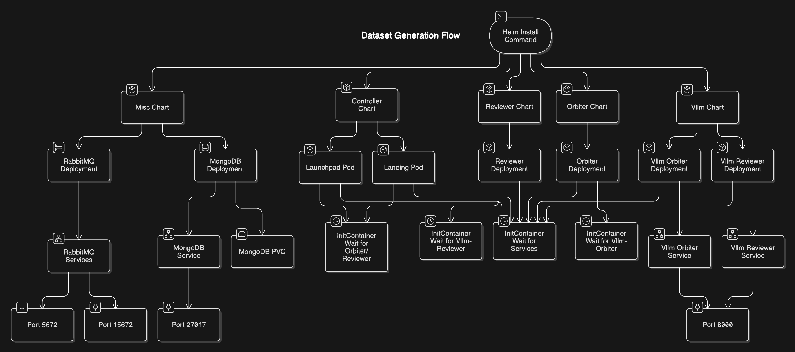

# Dataset Generation Chart Deployment

This repository contains Helm charts for deploying a distributed Dataset generation flow comprising RabbitMQ, MongoDB as fundemental modules along with 
promptlab/reviewer modules. Below is an overview of the deployment process and the components involved.

## Prerequisites

Ensure the following are installed and configured:

- Kubernetes cluster
- Helm CLI (v3 or higher)
- Persistent storage provisioner (for PVCs)
- GPU units 

## Deployment Overview
The deployment includes the following components:



## deployment steps:
Before starting the deployment process, ensure you update the `values.yaml` file with your specific configuration requirements, including service ports, storage settings, and resource limits.

### Steps:

1. Open the `values.yaml` file in your preferred editor and fill in the required values based on your environment.
2. Trigger the Helm deployment using the following command: 

```bash
helm install <deployment_name> -f values.yaml .
```

Replace `<deployment_name>` with your desired release name. The `-f values.yaml` flag ensures the deployment uses your customized configurations.

Monitor the deployment with:

```bash
helm status <deployment_name>
kubectl get pods
```

## Cleanup

To remove the deployment:

```bash
helm uninstall <deployment_name>

```

## Notes

- Make sure all configurations (e.g., `values.yaml`) are updated based on your environment.
- Monitor the deployment using tools like `kubectl get pods`, `kubectl logs`, and Helm release status commands.
